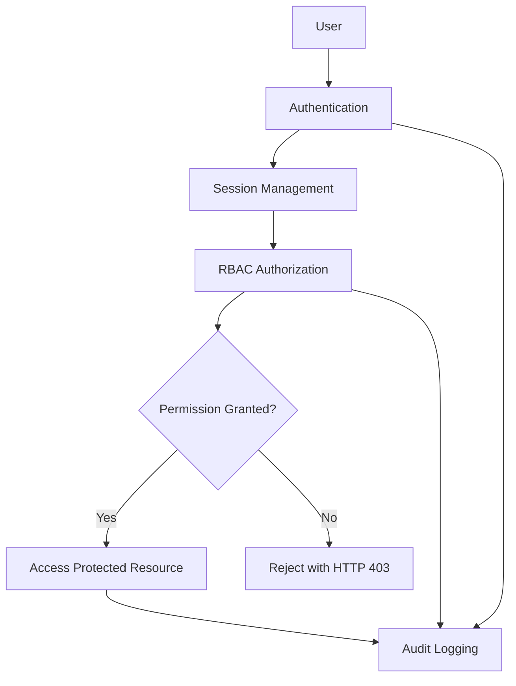

# SecureIAM — Digital Identity and Access Management System

A web-based Identity and Access Management (IAM) platform for centralized user authentication, role-based authorization, resource access requests, approval workflows, and security auditing.

## Overview

SecureIAM implements a simplified enterprise-style IAM system using Role-Based Access Control (RBAC). It manages identities, roles, permissions, and protected resources while demonstrating secure software engineering principles.

**Core access-control model:**

`User → Role → Permission → Resource`

## Features

- **User Registration and Authentication** — Account creation and secure login.
- **Password Management** — Password reset and secure password hashing.
- **Role Management** — Create and assign roles according to responsibilities.
- **Permission Management** — Associate permissions with roles and resources.
- **Access Requests** — Submit requests with a justification.
- **Approval Workflow** — Approve or reject requests through authorized reviewers.
- **Account Deactivation** — Disable accounts to prevent further authentication.
- **Audit Logging** — Record security-relevant events and administrative actions.
- **Security Auditor Dashboard** — Read-only access to audit information and security activity.
- **Authorization Enforcement** — Restrict protected operations using server-side permission checks.

## User Roles

| Role | Responsibilities |
|---|---|
| Employee | Authenticate and request access to resources |
| Manager | Review and approve or reject access requests |
| Administrator | Manage users, roles, permissions, and resources |
| Security Auditor | Review audit logs and monitor security events |

## Technology Stack

| Component | Technology |
|---|---|
| Frontend | HTML5, CSS3, JavaScript |
| UI Framework | Bootstrap 5 |
| Backend | PHP 8.x |
| Database | MySQL |
| Local Development | XAMPP, Apache |
| Version Control | Git, GitHub |
| Project Management | Jira, Scrum |
| UML Modeling | StarUML |
| Diagramming | Mermaid |
| Threat Modeling | Microsoft Threat Modeling Tool |
| Static Analysis | SonarQube |
| Security Testing | Burp Suite Community Edition |
| Containerization | Podman |
| Orchestration | Kubernetes, Minikube |
| CI/CD | GitHub Actions |

*The table identifies the intended project toolchain. Confirm the installed versions and actual integrations before documenting them as implemented.*

## Architecture

The application follows a layered design:

1. **Presentation Layer** — Login, registration, dashboards, and management interfaces.
2. **Application Layer** — Authentication, access requests, approvals, and account management.
3. **Authorization Layer** — Role and permission validation for protected operations.
4. **Data Layer** — Persistent storage of users, roles, permissions, resources, requests, and audit records.

### Logical Access Flow



## Security Considerations

SecureIAM addresses the following security risks:

- SQL injection through parameterized database queries.
- Weak password storage through password hashing.
- Privilege escalation through server-side authorization checks.
- Cross-Site Request Forgery through CSRF protection.
- Session fixation through session ID regeneration.
- Unauthorized account and permission changes through access control.
- Information disclosure through safe error handling.
- Limited accountability through security audit logs.
- Credential leakage through externalized secrets and repository hygiene.

Security controls must be verified against the actual implementation and test results.

## Database Model

The logical data model includes the following entities:

- Users
- Roles
- Permissions
- Resources
- User–Role Assignments
- Role–Permission Assignments
- Access Requests
- Audit Logs

The principal relationships are:

- A user can have one or more assigned roles.
- A role can contain multiple permissions.
- A permission governs an allowed operation on a resource.
- Access requests record requested access and approval decisions.
- Audit logs record relevant authentication and authorization events.

## Development Setup

### Prerequisites

- Windows, Linux, or another supported development environment
- PHP 8.x
- MySQL
- Apache or XAMPP
- Git
- A web browser

### 1. Clone the Repository

```bash
git clone <repository-url>
cd SecureIAM
```

Replace `<repository-url>` with the actual repository URL.

### 2. Configure the Database

1. Start Apache and MySQL through XAMPP.
2. Open phpMyAdmin.
3. Create a database named `secureiam`.
4. Import the project's SQL schema or database initialization script.
5. Configure the application to connect to the database.

Use environment variables or a local configuration file excluded from version control for credentials. Never commit real passwords, API keys, or production secrets.

### 3. Configure the Application

Set the required database connection values using the configuration mechanism implemented in the project.

Example environment variables:

```dotenv
DB_HOST=127.0.0.1
DB_PORT=3306
DB_NAME=secureiam
DB_USER=your_local_database_user
DB_PASS=your_local_database_password
```

These are configuration examples, not production credentials. The application must explicitly load the variables using its configured environment mechanism.

### 4. Run the Application

For an Apache/XAMPP setup:

1. Place the project in the configured web root, typically `htdocs`.
2. Start Apache and MySQL.
3. Open the application's configured local URL in a browser.

Example:

```text
http://localhost/SecureIAM/
```

Adjust the URL to match the actual directory and routing configuration.

## Security Testing

Recommended verification activities include:

| Test | Expected Result |
|---|---|
| Invalid login | Authentication rejected |
| SQL injection input | Input cannot alter query structure |
| Unauthorized administrative request | HTTP 403 or equivalent denial |
| Employee requests administrative function | Access denied |
| Security Auditor attempts log modification | Modification denied |
| Invalid CSRF token | Request rejected |
| Deactivated user attempts login | Authentication rejected |
| Access approval | Decision recorded in audit log |

Run security tests only against systems you own or are authorized to assess.

## Secure Development Workflow

The recommended workflow is:

```text
Feature Branch
      ↓
Pull Request
      ↓
Code Review
      ↓
Automated Tests
      ↓
Static Security Analysis
      ↓
Build and Package
      ↓
Deployment Validation
```

Recommended repository controls:

- Keep secrets out of source control.
- Review changes before merging.
- Protect the main branch.
- Pin or lock dependencies where supported.
- Scan code and dependencies.
- Run automated tests before release.
- Retain build and test evidence.

## Containerization and Deployment

The project can be packaged into a container using Podman or a compatible container build tool. Kubernetes manifests can define the application Deployment and Service.

Recommended deployment controls:

- Run containers as a non-root user where supported.
- Use a minimal, maintained base image.
- Avoid embedding secrets in images.
- Configure resource requests and limits.
- Restrict network exposure.
- Use Kubernetes Secrets or an appropriate external secret manager.
- Verify readiness, health, and access-control behavior before deployment.

Container and Kubernetes support should be considered implemented only after the image builds and the deployment has been tested successfully.

## Project Documentation

The project documentation covers:

- Agile planning and requirements engineering
- UML use-case modeling
- ER diagrams and data-flow diagrams
- Software architecture and UI design
- STRIDE threat modeling and attack trees
- Jira product backlog and sprint metrics
- Secure repository and build practices
- Secure coding and refactoring
- Containerization and Kubernetes
- CI/CD and security testing
- Logging, monitoring, and deployment hardening
- Final security review and traceability

## Scope and Limitations

SecureIAM is a simplified IAM implementation intended to demonstrate identity management, RBAC, access governance, and secure development practices. Enterprise deployment would require further assessment of high availability, MFA, centralized secrets management, advanced monitoring, incident response, and compliance requirements.

## License

Specify the applicable license before distributing or reusing this project.
